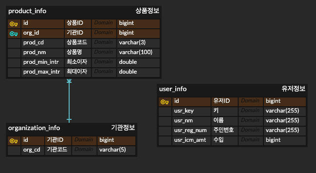

# 미니 대출 서비스

> 스프링부트 (3버전) 연습 겸 하는 프로젝트
>
> 비즈니스 로직보다는, Springboot 기능들 (AOP 등), Docker, NginX 등을 연습하기 위함

## Tech Stack

- Java 17
- Gradle
- Spring Boot 3.1.5
- Spring Data JPA
- Spring Security
- MySQL
- Redis
- Docker
- NginX

## ERD



## 프로젝트 실행 방법

> Mac OS 기준

1. /docker 폴더안에 env.properties 파일 생성
    - env-example.properties 파일 참고
2. /docker 폴더안에 .env 파일 생성
    - .env-example 파일 참고
3. module-core/src/main/resources/profiles 폴더안에 env.properties 파일 생성
    - env-example.properties 파일 참고
4. /docker/build-images.sh 실행 (Springboot build & Docker Image build)
    - HUB_USER 설정 필요 (Docker Hub 계정)
5. /docker 폴더안에 docker-compose.yml 파일로 컨테이너 실행
    - docker-compose up --build -d

## 상품 관련 API

1. GET `/fintech/v1/product/{organizationCode}`
    - 상품 목록 조회
    - Request Parameter
        - organizationCode: 기관 코드
    - Response
        ```json
      {
          "data" : [
              {
                  "organizationCode" : "00001",
                  "productCode" : "001",
                  "productMaximumInterest" : 9.9,
                  "productMinimumInterest" : 1.1,
                  "productName" : "상품명"  
              } 
          ],
      "responseCode" : "00",
      "responseMessage" : "success"
      }
        ```

2. POST `/fintech/v1/product/information`
    - 금융사로부터 상품 정보를 받는 API
    - Request Body
      ```json
      {
         "organizationCode" : "00001",
         "productCode" : "001",
         "productMaximumInterest" : 9.9,
         "productMinimumInterest" : 1.1,
         "productName" : "상품명"  
      }
      ```
    - Response
      ```json
      {
         "responseCode" : "00",
         "responseMessage" : "success"
      }
      ```

## 유저 관련 API

1. POST `/fintech/v1/user/information`
    - 유저 정보를 받는 API
    - Request Body
      ```json
      {
          "userIncomeAmount" : 10000,
          "userName" : "name",
          "userRegistrationNumber" : "000000-0000000"
      }
      ```
    - Response
      ```json
      {
          "data" : {
              "userKey" : "2casdasd21234234asdsxc"
          },
          "responseCode" : "00",
          "responseMessage" : "success"
      }
      ```

2. GET `/fintech/v1/user/private-info/{userKey}`
    - 유저의 개인정보를 조회하는 API
    - Request Parameter
        - userKey: 유저 키
    - Response
      ```json
      {
          "data" : {
              "userKey" : "2casdasd21234234asdsxc",
              "userRegistrationNumber" : "000000-0000000"
          },
          "responseCode" : "00",
          "responseMessage" : "success"
      }
      ```

## 요구 사항

### 상품 정보 관련 API 개발

- [x] 상품 정보 수신 API
    - 상품 정보에 변경이 발생하였을 때, 상품 정보 조회 API 의 캐시가 Evict 되어야합니다.
    - 금융사별, 상품별 로 데이터를 관리해야 합니다.

- [x] 상품 정보 조회 API
    - 상품 정보 조회는 모든 유저에게 동일한 상품을 노출해 줍니다.
    - Redis 를 사용하여 DB Transaction을 줄이는 방향으로 개발합니다.

### 유저 정보 관련 API 개발

- [x] 유저 정보 수신 API
    - 유저에 관련된 정보들을 받습니다.
    - 유저의 정보 중 민감한 정보는 모두 암호화 되어 데이터베이스에 저장되어야 합니다.
    - 단순히 암호화 필요한 데이터마다 암호화를 해줄 수도 있지만, 데이터베이스별로, 각 금융사별로 다른 키 값을 사용해서 암호화할 수 있고, 여러 데이터를 암호화해야하기에 공통적인 처리 로직을 만들어야 합니다.
    - 휴먼 에러를 줄이기 위해 데이터베이스에 저장 혹은 조회할 때에는 Entity 중에서 @Encrypt 라는 어노테이션이 붙은 칼럼은 암.복호화를 하도록 개발합니다.
    - @Encrypt Custom Annotation 만들기
    - AOP를 통해 find 함수, save 함수 를 PointCut 으로 잡고, 해당 Entity에 @Encrypt 어노테이션이 붙은 칼럼은 암호화 혹은 복호화를 하도록 개발합니다.

- [x] 유저 정보 조회 API
    - 위에 서술한 AOP를 통한 복호화가 잘 진행되는 지 확인할 수 있습니다.

### 공통

- [x] 모든 Request 는 AOP를 통해 로그를 찍을 수 있도록 하기
- [x] 기관별, 상품별로 데이터를 관리할 수 있도록 하기
- [x] 기관과 상품은 EnumClass 를 만들어주셔서 휴먼 에러 줄이기
- [x] 데이터베이스 Entity 역시 EnumClass 를 사용하고, Converter 이용 하기
- [x] 모든 API 에 Swagger 를 작성하기 ([user api](http://127.0.0.1/user-api), [product api](http://127.0.0.1/organization-api))
- [x] API 내에서 ExceptionHandling 을 ControllerAdvice 를 통해 처리하기
- [x] Docker 이미지를 만들기
- [x] Docker-Compose 를 사용해서 도커 이미지를 띄우기
- [x] 여러 개의 Spring Boot 서버를 띄우고 NginX와 연결하기